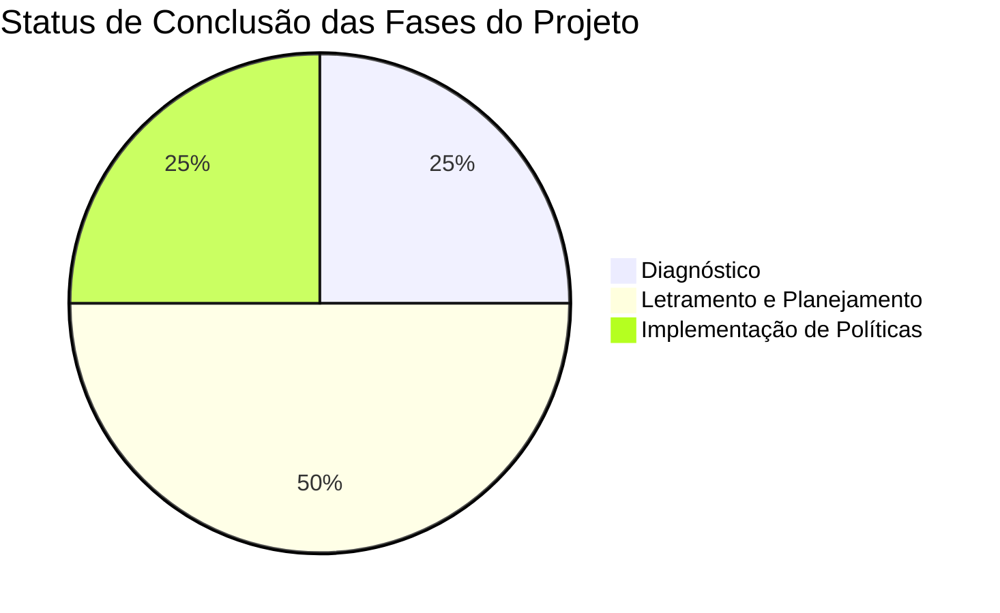
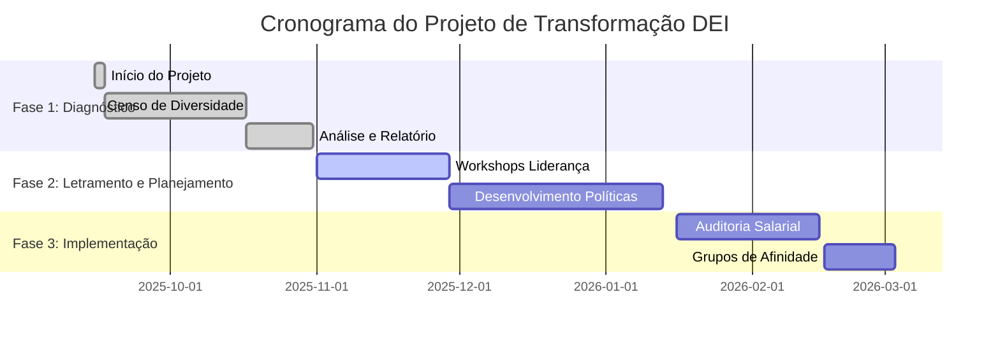
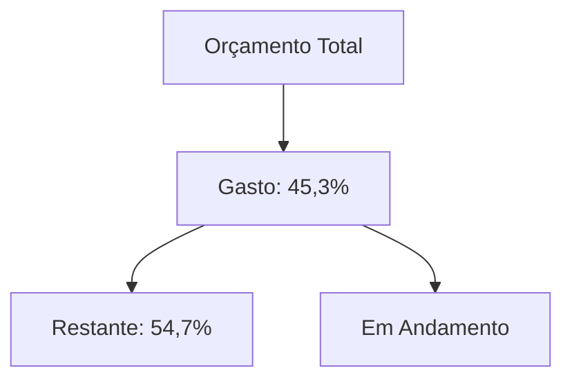
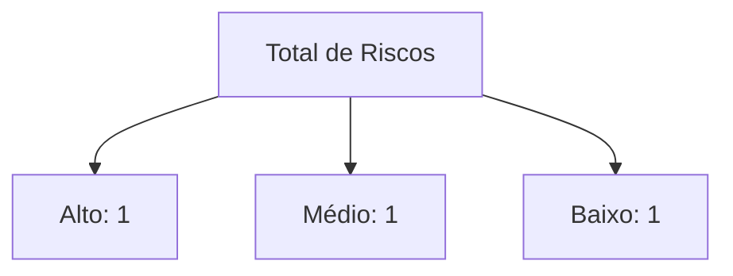

# Programa de Transformação DEI - Relatório de Status
**Período do Relatório: 1-28 de Novembro de 2025**

## Sumário Executivo

### Status Geral
🟢 **Status: EM ANDAMENTO, NO CAMINHO CERTO**
- Fase de Diagnóstico (Censo de Diversidade) 100% concluída.
- Workshops de Letramento para a alta liderança finalizados com alta taxa de satisfação.
- Cronograma do projeto mantido.
- Orçamento dentro dos parâmetros esperados para a fase.

### Painel de Métricas Chave

## 1. Visão Geral do Progresso

### 1.1 Destaques das Realizações
- ✅ **Censo de Diversidade (Insight):** Concluído com sucesso, com taxa de adesão de 92%, superando a meta de 85%.
- ✅ **Relatório de Diagnóstico:** Entregue e aprovado pelo Comitê de Diversidade do cliente, revelando gaps de representatividade em cargos de média e alta liderança.
- ✅ **Workshops de Letramento (DiverCidade Consultoria):** Realizados workshops de Letramento Racial e Liderança Inclusiva para 100% do C-Level, com avaliação média de 4.8/5.
- ✅ **Plano de Comunicação (Prisma):** Estratégia de comunicação para as próximas fases desenvolvida e aprovada.

### 1.2 Status da Fase Atual (Letramento e Planejamento)
| Métrica              | Planejado | Real | Status         |
|----------------------|-----------|------|----------------|
| Workshops para C-Level | 2         | 2    | ✅ Concluído    |
| Workshops para Gerência | 5         | 3    | 🟡 Em Progresso |
| Engajamento (NPS)    | 70        | 78   | ✅ Superando    |
| Definição de Políticas | 3         | 1    | 🟡 Em Progresso |

## 2. Status do Cronograma

### 2.1 Acompanhamento de Marcos
| Marco                                     | Data de Entrega | Status          | Comentários                                     |
|-------------------------------------------|-----------------|-----------------|-------------------------------------------------|
| Início do Projeto                         | 2025-09-15      | ✅ Concluído     | Kick-off realizado com sucesso.                 |
| Aplicação do Censo de Diversidade         | 2025-10-15      | ✅ Concluído     | Dados coletados e anonimizados.                 |
| Entrega do Relatório de Diagnóstico       | 2025-10-30      | ✅ Concluído     | Aprovado pelo Comitê de Diversidade.            |
| Fase de Letramento para Liderança         | 2025-11-28      | ✅ Concluído     | C-Level e Diretoria treinados.                  |
| Desenvolvimento de Políticas Inclusivas   | 2026-01-15      | 🟡 Em Progresso | Política de Recrutamento Inclusivo em rascunho.   |
| Auditoria de Equidade Salarial            | 2026-02-15      | ⚪ Não Iniciado  | Planejado para o próximo ciclo.                 |
| Lançamento dos Grupos de Afinidade        | 2026-03-01      | ⚪ Não Iniciado  | Dentro do cronograma.                           |

### 2.2 Análise do Caminho Crítico

## 3. Status do Orçamento

### 3.1 Resumo Financeiro
| Categoria                     | Orçamento    | Gasto        | Restante      | % Usado   |
|-------------------------------|--------------|--------------|---------------|-----------|
| Consultoria Estratégica (DiverCidade) | R$200.000    | R$90.000     | R$110.000     | 45%       |
| Tecnologia e Dados (Insight)  | R$100.000    | R$80.000     | R$20.000      | 80%       |
| Mídia e Comunicação (Uprise/Prisma) | R$75.000     | R$22.500     | R$52.500      | 30%       |
| Gerenciamento de Projeto      | R$75.000     | R$33.750     | R$41.250      | 45%       |
| Contingência                  | R$50.000     | R$0          | R$50.000      | 0%        |
| **Total**                     | **R$500.000**| **R$226.250**| **R$273.750** | **45,3%** |

### 3.2 Análise da Taxa de Consumo (Burn Rate)

## 4. Métricas de Qualidade

### 4.1 Status dos Entregáveis
- Adesão ao Censo de Diversidade: 92% (Meta: >85%)
- Avaliação Média dos Workshops (Liderança): 4.8 / 5.0
- Percepção de Segurança Psicológica (Baseline): 3.2 / 5.0 (Métrica a ser melhorada)
- Status do Canal de Denúncias: Em fase de reestruturação conforme recomendação.

### 4.2 Indicadores Chave de Desempenho (KPIs) do Projeto
| Métrica                         | Alvo   | Atual  | Status |
|---------------------------------|--------|--------|--------|
| Engajamento nos Workshops       | >90%   | 98%    | ✅     |
| Aprovação dos Entregáveis (Cliente) | 100%   | 100%   | ✅     |
| Variação no Orçamento           | <5%    | 0%     | ✅     |
| Atraso no Cronograma            | 0 dias | 0 dias | ✅     |

## 5. Avaliação de Riscos

### 5.1 Riscos Ativos
| Risco                                  | Probabilidade | Impacto | Status da Mitigação                                       |
|----------------------------------------|---------------|---------|-----------------------------------------------------------|
| Baixa adesão da média gerência         | Médio         | Alto    | Plano de comunicação focado nos benefícios para gestores. |
| Resistência cultural à mudança         | Alto          | Alto    | Patrocínio executivo ativo e comunicação contínua.        |
| Vazamento de dados sensíveis do Censo  | Baixo         | Alto    | Dados totalmente anonimizados pela plataforma Insight.    |

### 5.2 Tendência de Riscos

## 6. Status da Equipe

### 6.1 Alocação de Recursos
| Função                      | Alocado(s)      | Notas                               |
|-----------------------------|-----------------|-------------------------------------|
| CEO & Sponsor               | Tamara Braga    | Totalmente alocada                  |
| Gerente de Projeto          | PF Rezende      | Totalmente alocado                  |
| Especialista de Dados (Insight) | 1               | Alocado para análise e dashboards   |
| Consultor Sênior de DEI     | 2               | Liderando workshops e políticas     |
| Produtor de Conteúdo (Uprise) | 1               | Desenvolvendo comunicação interna   |

### 6.2 Saúde da Equipe
- Moral: Alto
- Produtividade: Dentro do esperado
- Colaboração: Forte, com sinergia entre os pilares do Hub
- Compartilhamento de conhecimento: Ativo através de sessões internas

## 7. Problemas e Decisões

### 7.1 Problemas Abertos
1. Dificuldade no agendamento dos workshops com a média gerência devido a conflitos de agenda.
2. Necessidade de definir os líderes dos futuros Grupos de Afinidade.
3. Acesso pendente a dados históricos de promoção para análise de equidade.

### 7.2 Decisões Recentes
1. Aprovado o desdobramento dos workshops de gerência em mais turmas para facilitar a participação.
2. Decidido que a escolha dos líderes dos GAs será feita por processo de candidatura voluntária.
3. Confirmado que a Auditoria de Equidade Salarial será o próximo foco da fase de implementação.

## 8. Próximos Passos

### 8.1 Ações Imediatas
1. Finalizar o agendamento de todos os workshops para a média gerência (Prazo: 5 de Dezembro).
2. Elaborar e divulgar o processo de candidatura para líderes dos Grupos de Afinidade (Prazo: 10 de Dezembro).
3. Iniciar a primeira versão da Política de Recrutamento Inclusivo (Prazo: 15 de Dezembro).

### 8.2 Próximos Marcos
1. Conclusão dos Workshops para Média Gerência (20 de Dezembro)
2. Apresentação do Plano de Políticas de DEI (15 de Janeiro de 2026)
3. Início da Auditoria de Equidade Salarial (16 de Janeiro de 2026)

## 9. Requisitos de Suporte

### 9.1 Recursos Necessários
- Liberação da agenda dos gerentes para participação nos workshops.
- Acesso aos dados históricos de remuneração e promoção para a auditoria.
- Orçamento para a cerimônia de lançamento dos Grupos de Afinidade.

### 9.2 Ações dos Stakeholders (Cliente Exemplo S.A.)
- Comunicar a importância da participação da gerência nos workshops.
- Aprovar o plano de acesso aos dados de remuneração com o Jurídico.
- Revisar e aprovar a Política de Recrutamento Inclusivo.

## 10. Apêndice

### 10.1 Documentos Chave
- [Relatório de Diagnóstico do Censo de Diversidade](../entregaveis/2025-10-30_relatorio-diagnostico-dei.md)
- [Apresentação do Workshop de Liderança Inclusiva](../entregaveis/2025-11-28_apresentacao-workshop-lideranca.md)
- [Plano de Ação do Projeto](../_briefing.md)

### 10.2 Informações de Referência
- Contrato do Projeto: [Link para o Contrato](../04_documentos/contratos/cliente-exemplo_programa-dei_contrato_2025-09-10.md)

---
*Nota: Este relatório de status segue as diretrizes de governança e transparência do DiverCidade Business Hub.*
