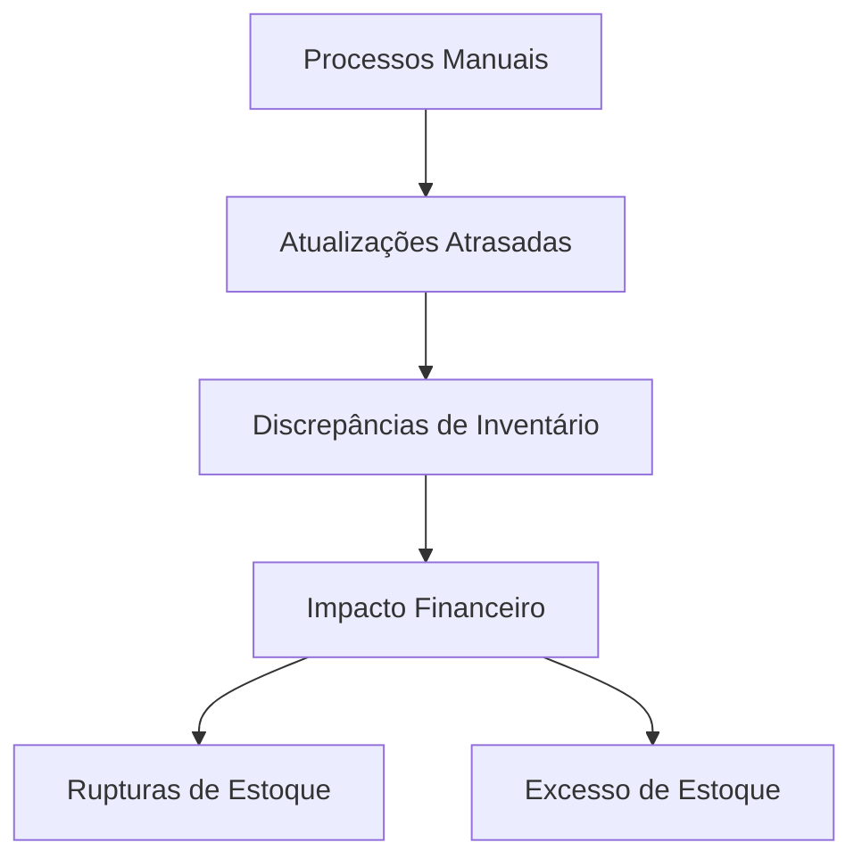
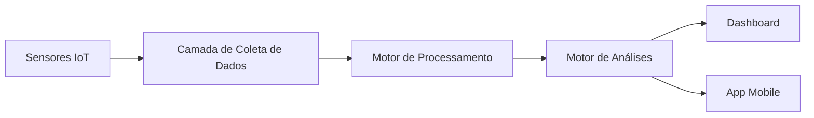

# Resumo Executivo

## Desafio
A XYZ Manufacturing enfrenta desafios significativos em seu processo atual de gestão de inventário:
- Contagem manual de estoque levando a 15% de discrepância
- Atualização dos níveis de estoque com 48h de atraso
- Perda anual de $750.000 devido a rupturas e excesso de estoque
- Visibilidade limitada entre cinco fábricas

## Solução
Propomos um Sistema de Gestão de Inventário em Tempo Real que irá:
- Reduzir a discrepância de inventário para <1%
- Fornecer atualizações de estoque em tempo real
- Economizar aproximadamente $500.000 por ano
- Integrar todas as unidades em um dashboard unificado

## Investimento e ROI
- Investimento Total: $375.000
- Economia Anual Esperada: $500.000
- Prazo de Retorno: 9 meses
- Benefício Líquido em 5 anos: $2.125.000

# Proposta Detalhada

## 1. Análise da Situação Atual

### 1.1 Visão Geral do Cliente
A XYZ Manufacturing é uma fabricante líder de equipamentos industriais com:
- 5 fábricas
- 10.000+ SKUs
- $100M de receita anual
- 250+ fornecedores

### 1.2 Desafios Identificados

### 1.3 Avaliação de Impacto
| Problema            | Impacto Atual       | Custo Anual |
| ------------------- | ------------------- | ----------- |
| Rupturas de estoque | Atrasos na produção | $450.000    |
| Excesso de estoque  | Armazenagem extra   | $200.000    |
| Contagem manual     | Horas de trabalho   | $100.000    |

## 2. Solução Proposta

### 2.1 Arquitetura do Sistema

### 2.2 Funcionalidades Principais
1. **Rastreamento em Tempo Real**
   - Integração com sensores IoT
   - Atualização automática dos níveis de estoque
   - Alertas e notificações em tempo real

2. **Dashboard Unificado**
   - Visibilidade entre unidades
   - Relatórios customizados
   - Análises preditivas

3. **Acesso Mobile**
   - Apps iOS e Android
   - Leitura de código de barras
   - Funcionalidade offline

4. **Capacidades de Integração**
   - Conexão com ERP
   - Portal de fornecedores
   - Integração com sistemas de expedição

## 3. Plano de Implementação

### 3.1 Cronograma
| Fase            | Duração    | Entregáveis-Chave       |
| --------------- | ---------- | ----------------------- |
| Descoberta      | 2 semanas  | Documento de requisitos |
| Design          | 4 semanas  | Arquitetura técnica     |
| Desenvolvimento | 16 semanas | Sistema principal       |
| Testes          | 4 semanas  | Garantia de qualidade   |
| Implantação     | 4 semanas  | Lançamento do sistema   |

### 3.2 Alocação de Recursos
- 1 Gerente de Projeto
- 2 Arquitetos de Solução
- 4 Desenvolvedores
- 2 Engenheiros de QA
- 1 Engenheiro DevOps

### 3.3 Mitigação de Riscos
| Risco                      | Probabilidade | Impacto | Estratégia de Mitigação   |
| -------------------------- | ------------- | ------- | ------------------------- |
| Complexidade de integração | Média         | Alta    | Abordagem faseada         |
| Migração de dados          | Média         | Alta    | Ferramentas automatizadas |
| Adoção do usuário          | Baixa         | Média   | Programa de treinamento   |

## 4. Estrutura de Investimento

### 4.1 Estrutura de Custos
| Componente      | Custo (USD) |
| --------------- | ----------- |
| Desenvolvimento | 225.000     |
| Hardware        | 75.000      |
| Treinamento     | 25.000      |
| Suporte         | 50.000      |
| **Total**       | **375.000** |

### 4.2 Cronograma de Pagamento
1. Início do Projeto: $93.750 (25%)
2. Aprovação do Design: $93.750 (25%)
3. Beta Release: $93.750 (25%)
4. Implantação Final: $93.750 (25%)

## 5. Benefícios Esperados

### 5.1 Benefícios Quantitativos
- Precisão do inventário: 99%
- Atualizações em tempo real: <1 segundo
- Otimização dos níveis de estoque: 30%
- Redução de custos de mão de obra: 45%

### 5.2 Benefícios Qualitativos
- Melhoria na tomada de decisão
- Relacionamento aprimorado com fornecedores
- Maior satisfação do cliente
- Vantagem competitiva

## 6. Suporte e Manutenção

### 6.1 Garantia
- Garantia de correção de bugs por 90 dias
- Suporte 24/7 para questões críticas
- Atualizações trimestrais

### 6.2 Acordo de Nível de Serviço
- 99,9% de disponibilidade do sistema
- Resposta em até 4h para questões críticas
- Monitoramento 24/7

## 7. Próximos Passos

### 7.1 Ações Imediatas
1. Apresentação técnica detalhada (28 de maio de 2025)
2. Demonstração de prova de conceito (4 de junho de 2025)
3. Revisão final da proposta (11 de junho de 2025)

### 7.2 Início do Projeto
- Assinatura do contrato
- Integração da equipe
- Reunião de kick-off

## 8. Por Que Escolher Nossa Solução

### 8.1 Experiência Relevante
- Solução similar implementada com sucesso para Acme Corp
- 15+ anos em soluções para manufatura
- 98% de satisfação dos clientes

### 8.2 Diferenciais Competitivos
- Integração IoT proprietária
- Tempos de resposta líderes de mercado
- Metodologia de ROI comprovada

## 9. Termos e Condições

### 9.1 Validade da Proposta
- Válida por 30 dias
- Preços garantidos
- Recursos reservados

### 9.2 Premissas
- Cliente fornece acesso aos dados
- Disponibilidade das partes interessadas
- Requisitos de infraestrutura

## Informações de Contato

**Contato Principal:**
Jane Doe
Diretora de Soluções
jane.doe@yourorg.com
+1 (555) 123-4567

**Contato Técnico:**
Alice Johnson
Arquiteta Técnica
alice.johnson@yourorg.com
+1 (555) 123-4568

---
*Nota: Esta proposta segue as diretrizes do Framework IDEKnow v2.0 para propostas a clientes.*
