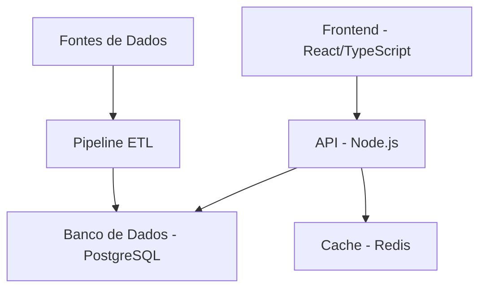

# Resumo do Projeto Alpha

## Resumo Executivo
O Projeto Alpha tem como objetivo desenvolver e implementar um dashboard de análises em tempo real para o departamento de operações da Acme Corporation. O sistema fornecerá insights imediatos sobre métricas-chave de desempenho, permitindo decisões baseadas em dados e melhorias na eficiência operacional.

## Contexto de Negócio
A Acme Corporation precisa modernizar suas capacidades de monitoramento operacional para manter vantagem competitiva em seu setor. O processo atual de relatórios manuais resulta em atrasos nos insights e possíveis oportunidades perdidas.

## Objetivos do Projeto

### Objetivos Principais
1. Implementar dashboard de visualização de dados em tempo real
2. Reduzir a latência de decisão operacional em 75%
3. Integrar com fontes de dados existentes
4. Permitir acesso móvel a métricas críticas
5. Alcançar 99,9% de disponibilidade do sistema

### Critérios de Sucesso
- [ ] Dashboard acessível em todas as plataformas requeridas
- [ ] Atualizações de dados em tempo real em até 500ms
- [ ] 100% de precisão na representação dos dados
- [ ] Taxa de adoção de usuários > 85%
- [ ] Métricas de desempenho dentro dos parâmetros especificados

## Escopo

### Incluído no Escopo
- Desenvolvimento do dashboard em tempo real
- Integração com fontes de dados
- Interface responsiva para dispositivos móveis
- Autenticação e autorização de usuários
- Desenvolvimento de widgets customizados
- Monitoramento de desempenho
- Materiais de treinamento para usuários

### Fora do Escopo
- Modificações em sistemas legados
- Migração de dados históricos
- Integração com sistemas de terceiros além das APIs especificadas
- Aplicativos móveis customizados
- Funcionalidade de modo offline

## Cronograma

### Principais Marcos

| Marco                          | Data Alvo  | Status       |
| ------------------------------ | ---------- | ------------ |
| Início do Projeto              | 2025-05-01 | Concluído    |
| Levantamento de Requisitos     | 2025-05-15 | Concluído    |
| Design Técnico                 | 2025-05-21 | Concluído    |
| Sprints de Desenvolvimento 1-3 | 2025-06-30 | Em Andamento |
| Testes de Usuário              | 2025-07-15 | Planejado    |
| Beta Release                   | 2025-07-31 | Planejado    |
| Deploy em Produção             | 2025-08-15 | Planejado    |
| Encerramento do Projeto        | 2025-08-31 | Planejado    |

## Recursos

### Composição da Equipe
- 1 Gerente de Projeto
- 1 Líder Técnico
- 3 Desenvolvedores Full-stack
- 1 Designer UX
- 1 Engenheiro de QA
- 1 Engenheiro DevOps

### Stack Tecnológico

## Avaliação de Riscos

### Riscos Identificados

| Risco                               | Probabilidade | Impacto | Estratégia de Mitigação                                              |
| ----------------------------------- | ------------- | ------- | -------------------------------------------------------------------- |
| Disponibilidade das fontes de dados | Média         | Alta    | Implementar tratamento de erros robusto e mecanismos de fallback     |
| Gargalos de desempenho              | Média         | Alta    | Testes de performance regulares e otimização                         |
| Resistência à adoção pelos usuários | Baixa         | Média   | Engajamento antecipado das partes e treinamento abrangente           |
| Complexidade técnica                | Média         | Média   | Documentação detalhada e sessões de compartilhamento de conhecimento |

## Alocação Orçamentária

### Detalhamento

| Categoria         | Alocação (%) | Valor (USD) |
| ----------------- | ------------ | ----------- |
| Desenvolvimento   | 60%          | 150.000     |
| Infraestrutura    | 15%          | 37.500      |
| QA & Testes       | 10%          | 25.000      |
| Gestão do Projeto | 10%          | 25.000      |
| Contingência      | 5%           | 12.500      |

## Plano de Comunicação

### Reuniões Regulares
- Daily Standup: 9:00 AM EST
- Planejamento de Sprint: Segunda-feira alternada
- Revisão de Sprint: Sexta-feira alternada
- Comitê Diretor Mensal
- Atualização Quinzenal com o Cliente

### Principais Stakeholders
1. Bob Smith - Patrocinador do Cliente
2. Jane Doe - Gerente de Projeto
3. Alice Johnson - Líder Técnica
4. Chefes de Departamento (Acme Corp)

## Garantia de Qualidade

### Estratégia de Testes
- Testes Unitários (cobertura mínima de 90%)
- Testes de Integração
- Testes de Performance
- Testes de Aceitação do Usuário
- Testes de Segurança
- Testes de Compatibilidade Móvel

### Requisitos de Performance
- Tempo de carregamento: < 2 segundos
- Atualizações em tempo real: < 500ms
- Usuários simultâneos: 100+
- Suporte a navegadores: 2 últimas versões dos principais browsers

## Dependências

### Dependências Externas
- Acesso à API da Acme Corp
- Fornecedores de dados de terceiros
- Provisionamento de infraestrutura em nuvem
- Liberação de segurança para acesso a dados

### Dependências Internas
- Aprovação do design UX
- Revisão de arquitetura
- Avaliação de segurança
- Ambiente de testes de performance

## Gestão de Mudanças

### Visão Geral do Processo
1. Submissão de solicitação de mudança
2. Análise de impacto
3. Revisão das partes interessadas
4. Aprovação/rejeição
5. Planejamento de implementação
6. Execução e validação

## Aprovação

### Assinatura Necessária de
- [ ] Patrocinador do Cliente (Bob Smith)
- [ ] Gerente de Projeto (Jane Doe)
- [ ] Líder Técnica (Alice Johnson)
- [ ] Líder de Segurança
- [ ] Diretor de Operações (Acme Corp)

## Atualizações e Revisões

| Versão | Data       | Autor         | Alterações                           |
| ------ | ---------- | ------------- | ------------------------------------ |
| 1.0    | 2025-05-01 | Jane Doe      | Criação inicial do resumo            |
| 1.1    | 2025-05-15 | Jane Doe      | Atualização do cronograma e recursos |
| 1.2    | 2025-05-21 | Alice Johnson | Adição de especificações técnicas    |

---
*Nota: Este resumo de projeto segue as diretrizes do Framework IDEKnow v2.0 para documentação de projetos.*
